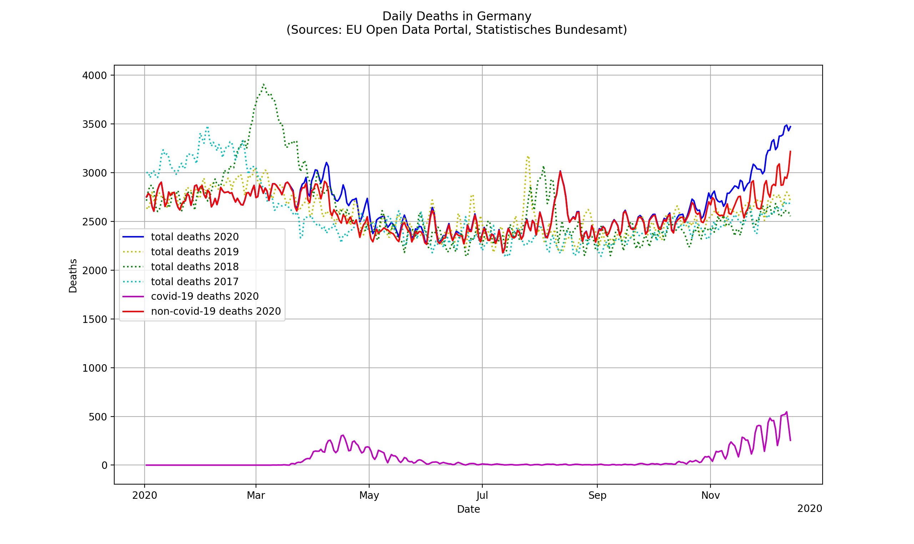
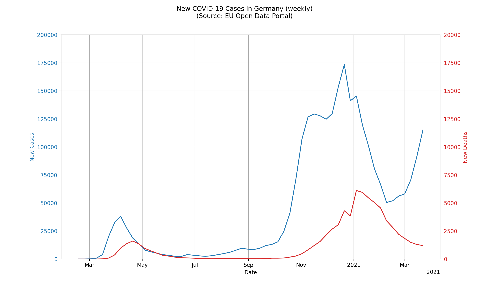
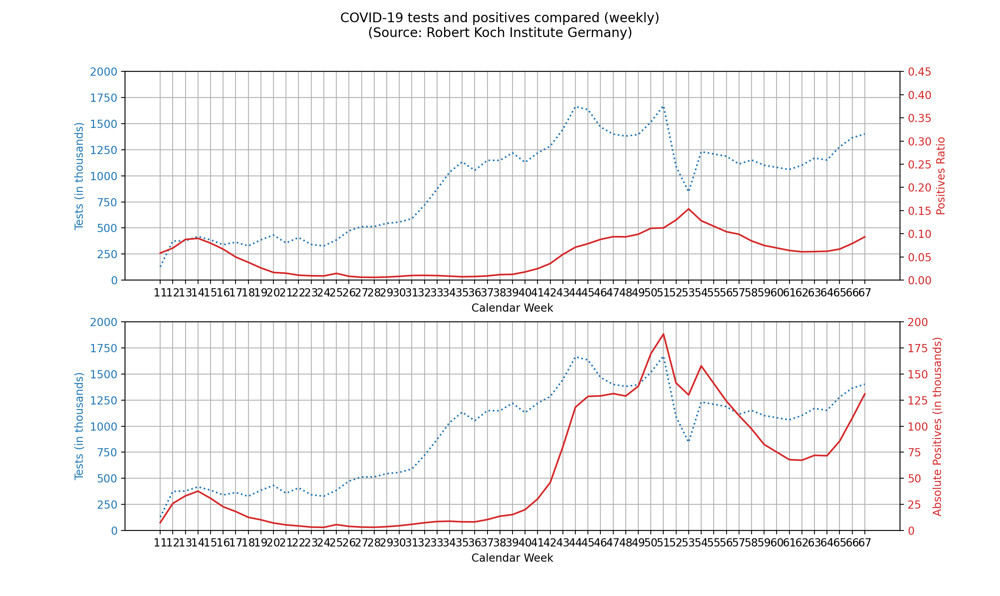

# corona-integration
Integration of different corona virus related datasets into a single database. Contains different statistics and viualizations which are mostly focused on Germany and Europe.

I have created these scripts to quickly query raw corona data using sql and to be able to run my own statistics on it. I am doing this out of own curiosity. If this helps anyone, please feel free to use this as a start for your own analysis.

## Getting started
To install the required packages run the following commands:

`python3 -m venv ./venv;`
`source venv/bin/activate;`
`pip install -r requirements.txt;`

## Creating the database
If you follow these steps you will find a `data.sqlite` file in the `/data` folder which will contain all the integrated datasets in its tables. Once the original data sources change you can re-run the download and create commands to update the database.

### Downloading the datasets
`python corona_database.py --download;`

### Creating backups
`python corona_database.py --save_backup;`

### Loading backups
`python corona_database.py --load_backup;`

### Integrating tables into database
`python corona_database.py --create_database;`

## Database schema
Fields in Table: `corona_cases`
* date reported
* day
* month
* year
* cases
* deaths
* country
* geo id
* country code
* population
* continent
* processed (time of insertion into database)

Fields in Table: `deaths_germany`
* date
* age group start (lower age limit, e.g. 30 years)
* age group end (upper age limit, e.g. 50 years)
* deaths (deaths 
* processed (time of insertion into database)

Fields in Table `rki_tests`
* calendar week
* tests
* positives
* participating laboratories
* processed (time of insertion into database)

## Sources
The integrated sources so far consist of:
* the total number of COVID-19 cases reported worlwide, comming from the EU Open Data Portal (https://data.europa.eu/euodp/en/data/dataset/covid-19-coronavirus-data) 
* the total number of all cause deaths in Germany, reported by the Statistisches Bundesamt (https://www.destatis.de/DE/Themen/Gesellschaft-Umwelt/Bevoelkerung/Sterbefaelle-Lebenserwartung/Tabellen/sonderauswertung-sterbefaelle.html)
* the total number of performed corona tests in Germany, reported by the Robert Koch Institute (https://www.rki.de/DE/Content/InfAZ/N/Neuartiges_Coronavirus/Situationsberichte/2020-05-06-de.pdf)

## Results

### Total deaths in relation to corona deaths in germany
The source code can be found in the function `total_corona_deaths_germany` in `corona_analysis.py`. Because of the registration delay of deaths at the Statistisches Bundesamt the data is not up to date (behind by about 3-5 Weeks). This curve is smoothed by averaging each day with the day before (sliding window smoothing with a window size of 2 and a stride of 1).

**Note**: The death toll underlies daily (and yearly) fluctuations. Statistically significant conclusions regarding overlap of deaths due to COVID-19 and deaths that would have occured anyway cannot be drawn based on this graph.

### Corona new cases/deaths per day in germany
The source code can be found in the function `corona_cases_germany` in `corona_analysis.py`. This curve is smoothed by averaging each day with 3 days before (sliding window smoothing with a window size of 4 and a stride of 1).

### Corona positives compared to total tests
The source code can be found in the function `positives_to_tests_germany` in `corona_analysis.py`. 

